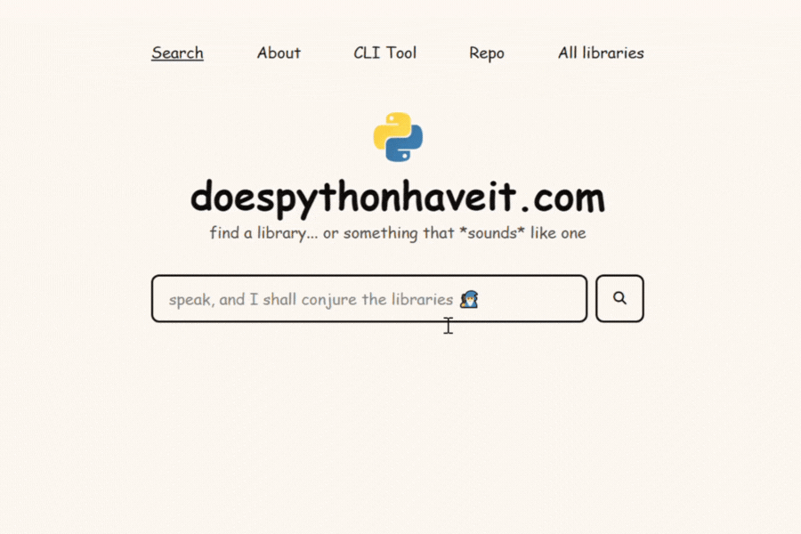

*You are looking at the backend, to see the frontend repository, [click here](https://github.com/hasboi/doespythonhaveit-web)*

# doespythonhaveit.com
A tiny open-source library engine powered by FastAPI and sentence_transformer.
You can try it live at [doespythonhaveit.com](https://doespythonhaveit.com) or soon use it directly from your terminal.

## Table of Contents
- [About](#about)
- [Features](#features)
- [Contributions](#contributions)
- [Installation](#Installation)
- [Acknowledgements](#acknowledgements)
- [License](#license)

## About
I built **doespythonhaveit** because I think it is nice to have a place where you can find libraries that fit your projects.

So instead of memorizing 9000 library names, this little app lets you search libraries *semantically*, like, you can type:
> "machine learning time series"

and it'll (hopefully) find stuff like `scikit-learn` or `darts`.  

## Features
- Search Python libraries using natural language
- Runs on **FastAPI** with **Sentence Transformers**
- Simple JSON dataset
- (TBA) Search in your terminal
- Contributions are welcome (please I am very new here)


## Contributions
Contributions are *super* appreciated, I'm still learning how to do this whole open-source thing, so every bit of help means a lot 🙏  

If you'd like to contribute (thank you so much!!), the main files to focus on are:
- `main.py` => where the FastAPI magic happens  
- `libraries.json` => the dataset that powers the search  

But honestly, if you spot something off anywhere else or have a cool idea, go for it! I'll probably love you forever

### Contribution Flow
1. **Fork** this repository  
2. **Create a new branch** for your feature or fix  
   ```bash
   git checkout -b your-cool-idea
    ```

3. Make your changes (and test them if possible)

4. Commit and push your work
    ```bash
    git commit -m "feat: added something cool"
    git push origin feature/your-cool-idea
    ```

5. Open a Pull Request (PR), explain what you changed and why

6. I'll check it out, maybe test it, and if it is awesome, I will merge it!

*Prefix commit messages with `feat:`, `fix:`, `docs:`, etc. (optional but cool)

# Installation 
In case you want to run this locally.

1. Clone both repositories:
    ```bash
    # backend (API)
   git clone https://github.com/hasboi/doespythonhaveit.git
   cd dphi-api

   # frontend
   git clone https://github.com/hasboi/doespythonhaveit-web.git
    cd doespythonhaveit-web
   ```
   You should now have two folders sitting side by side

2. Create virtual environment in your API folder and activate it:
    ```bash
    python -m venv venv
    source venv/bin/activate    # on Linux/Mac
    venv\Scripts\activate       # on Windows

    # I often get confused about creating virtual environment but I hope this is the correct way
    ```

3. Install dependencies:
    ```bash
    pip install -r requirements.txt
    ```

4. Run the server:
    ```bash
    uvicorn main:app --reload
    ```

5. Then access it from `index.html`, I suggest to use VS code's live server or Python's local web server (you can find it in the doespythonhaveit btw).  
   You might also want to double-check the allowed origins in `main.py`, these define which URLs can talk to your API:  
   ```python
   origins = [
       "http://localhost:5500",
       "http://127.0.0.1:5500",
       "http://127.0.0.1:5000",
       "http://localhost:3000",
       "https://doespythonhaveit.com",
   ]
   ```
   If you're testing from a different port (like using a custom frontend), make sure to add your URL here, or the browser will hit you with that CORS policy.

## Acknowledgements

Massive thanks to:
- **FastAPI** for letting my backend actually be fast  
- **Sentence Transformers** for giving the search engine a brain  
- **Awesome Python** for being the motherlode of library inspiration  
- And every kind soul contributing, fixing typos, or just cheering from the sidelines 💙  

## License
This project is licensed under the MIT license, see [LICENSE](https://github.com/hasboi/doespythonhaveit/blob/main/LICENSE)